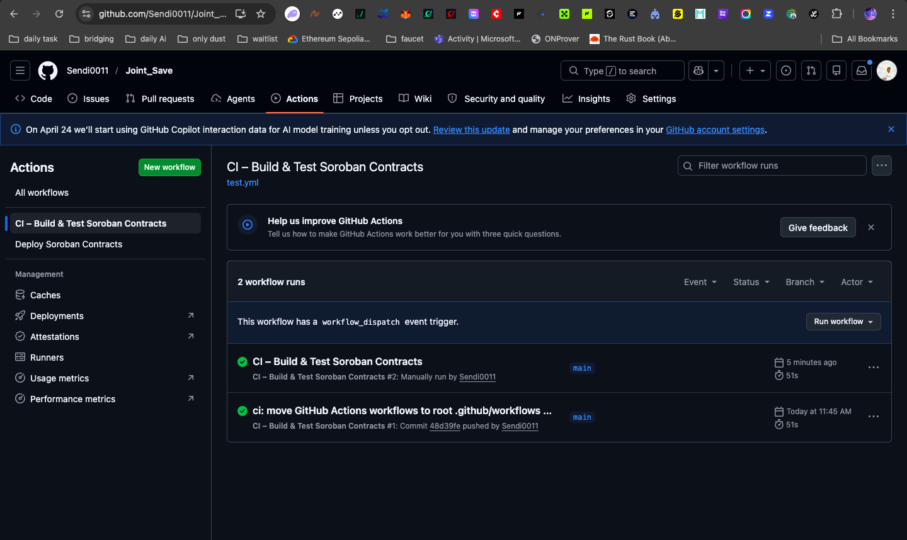
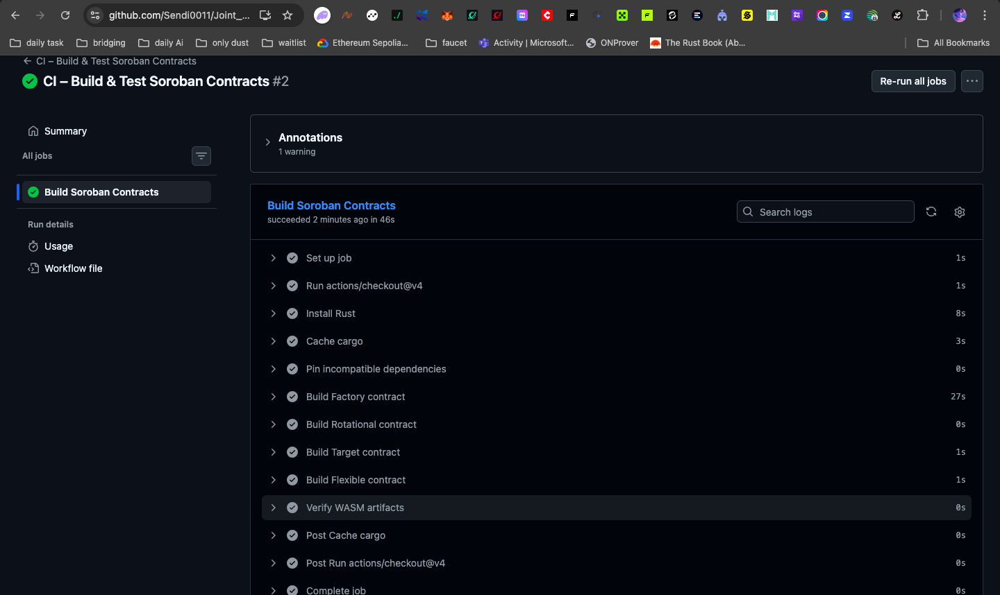
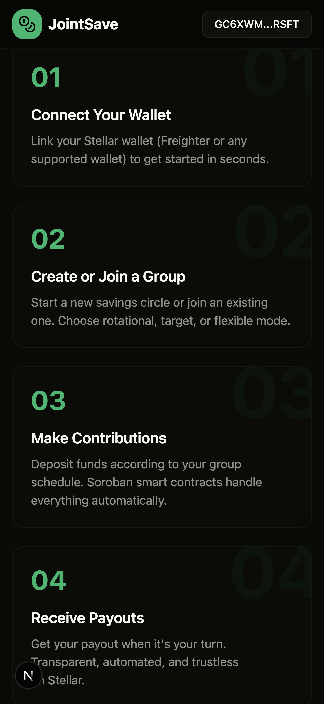
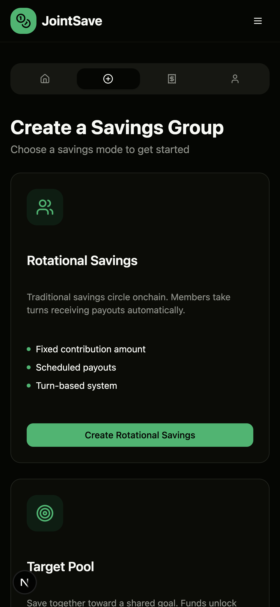
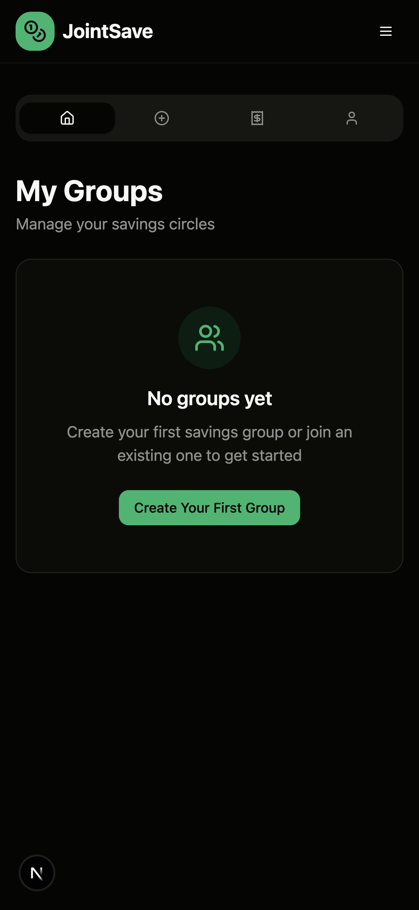

# JointSave 🌐
### Community Savings Circles on Stellar

[](https://github.com/Sendi0011/Joint_Save/actions/workflows/test.yml)

**JointSave** is a decentralized community savings platform built on **Stellar**, enabling trusted groups to automate contributions, payouts, and transparency using Soroban smart contracts.

---

## Live Demo

🚀 **[https://joint-save.vercel.app](https://joint-save.vercel.app)**

---

## Overview

Across the world, millions of people rely on informal savings groups to pool money and support one another. While these systems foster trust and cooperation, they often face problems like missed payments, fraud, and lack of transparency.

**JointSave solves this by putting savings groups onchain — on Stellar.**
Funds are managed by Soroban smart contracts, ensuring automation, transparency, and fairness for everyone.

---

## Key Features

- **Rotational Mode** – Members take turns receiving the full pool payout.
- **Target Pool Mode** – Groups save toward a shared goal.
- **Flexible Pool Mode** – Members deposit anytime and optionally earn yield.
- **Inter-Contract Calls** – Factory contract registers and coordinates all pool contracts on-chain.
- **Onchain Trust** – Every group is governed by a Soroban smart contract escrow.
- **Transparent Tracking** – Every transaction is verifiable on Stellar.
- **Auto Enforcement** – Late deposits are flagged; missed rounds trigger penalties.

---

## Tech Stack

**Smart Contracts (Rust / Soroban)**
- `jointsave-factory` – Registry for all deployed pools (inter-contract coordination)
- `jointsave-rotational` – Rotational savings pool
- `jointsave-target` – Goal-based savings pool
- `jointsave-flexible` – Flexible deposits with optional yield

**Frontend**
- **Next.js** + **Tailwind CSS** – Responsive, mobile-first interface
- **Stellar Wallets Kit** – Freighter and multi-wallet support
- **Stellar SDK** – Soroban contract interaction
- **Supabase** – Off-chain metadata storage

**Infrastructure**
- **Stellar Network** – Fast, low-cost, and energy-efficient
- **Soroban** – Stellar's smart contract platform
- **Vercel** – Frontend deployment
- **GitHub Actions** – CI/CD pipeline

---

## Deployed Contracts (Stellar Testnet)

| Contract | Address / Hash |
|---|---|
| JointSave Factory | `CBZNGP52FLFZ4BOGC265FUAMP5KFMAYPQK3KTI5UHMYVMM3QCST3IMRI` |
| Rotational Pool WASM | `d350a325d8734263a3d7150c875555d8956e13a527fb3497d5141b8b3f3d2c74` |
| Target Pool WASM | `133a62226501fc5443e70007d79deeeb0b33fdf8c85c7fcd3cf16293bb5c7292` |
| Flexible Pool WASM | `df6ff088fd79f13d8d03e72160434517fdb4a83b8c7bfdd887be4369805e0d6b` |

**Deployment Date:** 2026-04-16  
**Network:** Stellar Testnet (`Test SDF Network ; September 2015`)

---

## Inter-Contract Calls

The Factory contract acts as the central registry. After deploying each pool contract separately, the pool is registered with the factory via `register_rotational`, `register_target`, or `register_flexible`. This creates an inter-contract relationship where:

1. Factory stores all pool contract IDs on-chain
2. Frontend queries the factory to discover all active pools
3. Pool contracts are deployed from WASM hashes stored in the factory registry

---

## CI/CD Pipeline

Two GitHub Actions workflows are configured:

- **`test.yml`** – Runs on every push/PR: builds all 4 Soroban contracts and verifies WASM artifacts
- **`deploy.yml`** – Manual trigger: builds and deploys all contracts to Stellar Testnet




---

## Mobile Responsive Design

JointSave is fully mobile responsive with:
- Collapsible navigation with hamburger menu on mobile
- Responsive grid layouts (1 col mobile → 3 col desktop)
- Touch-friendly tab navigation in the dashboard
- Fluid typography and spacing via Tailwind CSS






---

## Getting Started

### Smart Contracts

```bash
cd smartcontract
rustup target add wasm32-unknown-unknown
stellar contract build
./scripts/deploy.sh
```

### Frontend

```bash
cd frontend
npm install
cp .env.example .env.local
# Fill in your Supabase and Stellar contract IDs
npm run dev
```

### Environment Variables

```env
NEXT_PUBLIC_SUPABASE_URL=
NEXT_PUBLIC_SUPABASE_ANON_KEY=
NEXT_PUBLIC_STELLAR_RPC_URL=https://soroban-testnet.stellar.org
NEXT_PUBLIC_STELLAR_HORIZON_URL=https://horizon-testnet.stellar.org
NEXT_PUBLIC_FACTORY_CONTRACT_ID=CBZNGP52FLFZ4BOGC265FUAMP5KFMAYPQK3KTI5UHMYVMM3QCST3IMRI
NEXT_PUBLIC_TOKEN_CONTRACT_ID=native
```

---

## Roadmap

**Phase 1 – MVP (Current)**
- Group creation & contributions on Stellar
- Rotational / Target / Flexible modes
- Wallet connection and basic dashboard
- Factory inter-contract registry
- CI/CD pipeline

**Phase 2 – Enhancement**
- Yield integrations with Stellar DeFi
- Mobile app
- Group chat
- Reputation system

**Phase 3 – Scale**
- Social onboarding
- Fiat on-ramp
- Microloan marketplace
- DAO governance

---

Built with ❤️ for communities worldwide. Powered by Stellar.
